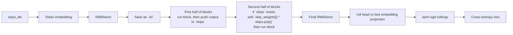
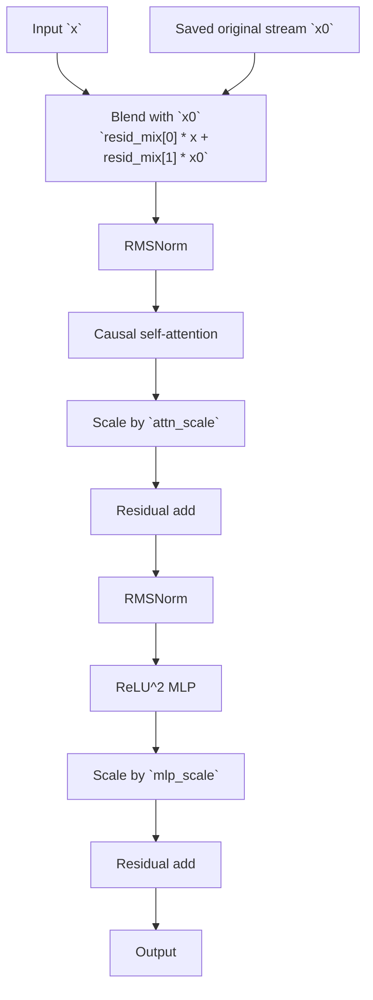

# Residual Paths and Skip Connections

This document explains the least textbook part of `train_gpt.py`:

- `x0`
- `resid_mix`
- `attn_scale`
- `mlp_scale`
- `skip_weights`
- the first-half / second-half stack split

Short answer:

- the high-level ideas in the earlier write-up were mostly correct
- two exact details matter a lot:
  - `resid_mix` happens at the start of each block, before attention
  - skip connections are added before each block in the second half, in reverse order, only while saved skips exist

Also, "encoder half" and "decoder half" are just convenient names for the first and second parts of one autoregressive stack. This is not a separate seq2seq encoder-decoder model.

## 1. The Smallest Mental Model

If you only want the big picture, it is this:

1. embed tokens
2. RMSNorm once
3. save that tensor as `x0`
4. run the first half of blocks and push each output onto `skips`
5. run the second half of blocks; before each block, if a saved skip exists, add `skip_weights[i] * skips.pop()`
6. final RMSNorm, output projection, softcap, loss

So the model has two unusual ideas at the same time:

- every block can look back at the original embedding stream `x0`
- later blocks can reuse earlier block outputs through cross-half skip connections

## 2. The Exact Code Path in `GPT.forward`

This is the core logic from `train_gpt.py`, with only spacing/comments simplified:

```python
x = self.tok_emb(input_ids)
x = F.rms_norm(x, (x.size(-1),))
x0 = x
skips: list[Tensor] = []

for i in range(self.num_encoder_layers):
    x = self.blocks[i](x, x0)
    skips.append(x)

for i in range(self.num_decoder_layers):
    if skips:
        x = x + self.skip_weights[i].to(dtype=x.dtype)[None, None, :] * skips.pop()
    x = self.blocks[self.num_encoder_layers + i](x, x0)
```

Important details:

- `x0` is saved once and reused in every block.
- `x0 = x` is not a clone, but later code rebinds `x` instead of mutating it in place, so `x0` still points to the original post-embedding normalized tensor.
- `skip_weights[i]` is indexed by decoder step.
- `skips.pop()` returns saved encoder-half outputs in reverse order.
- If the second half has one extra block, that last block simply runs with no skip add because `skips` is empty.

## 3. Tensor Cheat Sheet

| Name | Shape | What it means |
|---|---|---|
| `x` | `[batch, seq, dim]` | Current hidden state moving through the network |
| `x0` | `[batch, seq, dim]` | The original hidden state right after embedding + first RMSNorm |
| `resid_mix` | `[2, dim]` | Per-channel weights for blending current `x` with original `x0` |
| `attn_scale` | `[dim]` | Per-channel gain on the attention residual branch |
| `mlp_scale` | `[dim]` | Per-channel gain on the MLP residual branch |
| `skip_weights` | `[num_skip_weights, dim]` | Per-channel gain on each popped cross-half skip |

The `[None, None, :]` part in the code broadcasts these per-channel vectors across batch and sequence dimensions.

## 4. Whole-Model Flow Diagram



## 5. One Block in Slow Motion

This is the actual block logic:

```python
mix = self.resid_mix.to(dtype=x.dtype)
x = mix[0][None, None, :] * x + mix[1][None, None, :] * x0
attn_out = self.attn(self.attn_norm(x))
x = x + self.attn_scale.to(dtype=x.dtype)[None, None, :] * attn_out
x = x + self.mlp_scale.to(dtype=x.dtype)[None, None, :] * self.mlp(self.mlp_norm(x))
return x
```

Read that in this order:

1. choose a base stream by blending current `x` and original `x0`
2. run attention on that blended stream
3. add the attention branch back with per-channel scale `attn_scale`
4. run the MLP on the updated stream
5. add the MLP branch back with per-channel scale `mlp_scale`

The most important correction for intuition is this:

> `resid_mix` is not an extra add after attention.
> It changes the block input before attention and MLP happen.

So the block is closer to:

```text
start_of_block = blend(current_stream, original_stream)
then do normal attention residual
then do normal MLP residual
```

not:

```text
do a normal block first
then mix in x0 afterward
```

## 6. Single-Block Flow Diagram



## 7. What Each Learned Tensor Is Doing

### `resid_mix`

`resid_mix` has shape `[2, dim]`.

So for each hidden channel:

```text
x[channel] = resid_mix[0, channel] * x[channel]
           + resid_mix[1, channel] * x0[channel]
```

That means the block can learn, per channel:

- mostly trust the current hidden state
- mostly trust the original embedding stream
- use a mixture of both

### `attn_scale` and `mlp_scale`

These are both shape `[dim]`.

So instead of a plain residual add:

```text
x = x + attn_out
x = x + mlp_out
```

the block does:

```text
x = x + attn_scale * attn_out
x = x + mlp_scale * mlp_out
```

That gives per-channel control over how strong each branch should be.

### `skip_weights`

`skip_weights` has shape:

```text
[num_skip_weights, dim]
```

So the cross-half skip is not just:

```text
x = x + skip
```

It is:

```text
x = x + skip_weights[i] * skip
```

Again, this is per-channel control.

## 8. Worked Example for `NUM_LAYERS = 9`

In this repo:

```text
num_encoder_layers = num_layers // 2 = 4
num_decoder_layers = 9 - 4 = 5
num_skip_weights = min(4, 5) = 4
```

So the stack is split like this:

```text
First half:
block 0 -> save skip_0
block 1 -> save skip_1
block 2 -> save skip_2
block 3 -> save skip_3

Second half:
decoder step 0 -> add skip_weights[0] * skip_3 -> run block 4
decoder step 1 -> add skip_weights[1] * skip_2 -> run block 5
decoder step 2 -> add skip_weights[2] * skip_1 -> run block 6
decoder step 3 -> add skip_weights[3] * skip_0 -> run block 7
decoder step 4 -> no skip left               -> run block 8
```

That is the exact pairing. Notice the two different orderings:

- saved activations are produced in forward order: `skip_0`, `skip_1`, `skip_2`, `skip_3`
- reused activations are consumed in reverse order: `skip_3`, `skip_2`, `skip_1`, `skip_0`

And the weight index follows decoder time:

- decoder step `0` uses `skip_weights[0]`
- decoder step `1` uses `skip_weights[1]`
- decoder step `2` uses `skip_weights[2]`
- decoder step `3` uses `skip_weights[3]`

## 9. What This Looks Like Compared With a Plain Transformer

A very plain transformer block might look like:

```python
attn_out = self.attn(self.attn_norm(x))
x = x + attn_out
x = x + self.mlp(self.mlp_norm(x))
```

and the stack might be:

```python
for block in self.blocks:
    x = block(x)
```

This repo instead has:

```python
x = resid_mix_x * x + resid_mix_x0 * x0
x = x + attn_scale * Attention(RMSNorm(x))
x = x + mlp_scale * MLP(RMSNorm(x))

if skips:
    x = x + skip_weights[i] * skips.pop()
```

So the extra expressiveness comes from:

- mixing the original stream back into every block
- scaling residual branches channel by channel
- reusing earlier activations later in the stack

## 10. Initialization Nuance That Is Easy To Miss

These parameters start as:

- `resid_mix = [1, 0]` per channel
- `attn_scale = 1`
- `mlp_scale = 1`
- `skip_weights = 1`

At the same time:

- attention output projections are zero-initialized
- MLP output projections are zero-initialized

So at the very start of training:

- each block begins by using the current stream `x`, not `x0`
- attention and MLP branches initially contribute `0`
- the first half initially passes `x` through unchanged
- the second half can still add saved skips because `skip_weights` starts at `1`

That means it is fair to say the block-level routing starts from a simple setting, but it is not quite accurate to say the entire model starts as a textbook plain transformer.

One more subtlety:

- because the model ends with RMSNorm, pure scalar rescaling of the hidden state matters less than it would in an unnormalized stack

## 11. Why This Can Help

The intuition is:

- `x0` gives every block a path back to token-level information
- `attn_scale` and `mlp_scale` let the model damp or strengthen residual branches per channel
- skip reuse lets later blocks recover features from earlier depth instead of rebuilding everything

This is a cheap way to add control:

- `resid_mix` is only `2 * dim` numbers per block
- `attn_scale` is only `dim`
- `mlp_scale` is only `dim`
- `skip_weights` is only `num_skip_weights * dim`

So it is exactly the kind of thing you might try in a parameter-budget challenge.

## 12. How the Repo Treats These Tensors During Training and Export

These tensors are considered special "control" parameters.

The code marks them by name:

```python
CONTROL_TENSOR_NAME_PATTERNS = tuple(
    pattern
    for pattern in os.environ.get(
        "CONTROL_TENSOR_NAME_PATTERNS",
        "attn_scale,attn_scales,mlp_scale,mlp_scales,"
        "resid_mix,resid_mixes,q_gain,skip_weight,skip_weights",
    ).split(",")
    if pattern
)
```

Then they are routed into the scalar/control optimizer group instead of Muon's matrix group:

```python
scalar_params = [
    p
    for name, p in block_named_params
    if p.ndim < 2 or any(pattern in name for pattern in CONTROL_TENSOR_NAME_PATTERNS)
]
if base_model.skip_weights.numel() > 0:
    scalar_params.append(base_model.skip_weights)
```

And during int8 export they are kept in floating-point form instead of being aggressively quantized.

So these are not treated like "just another weight matrix." The repo explicitly protects them as small but important routing knobs.

## 13. One-Sentence Intuition

Each block first decides how much to trust the current stream versus the original embedding stream, then applies attention and MLP with learned per-channel gains, while the second half of the network also pulls useful earlier features back in through reversed skip connections.
