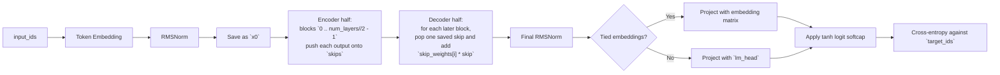
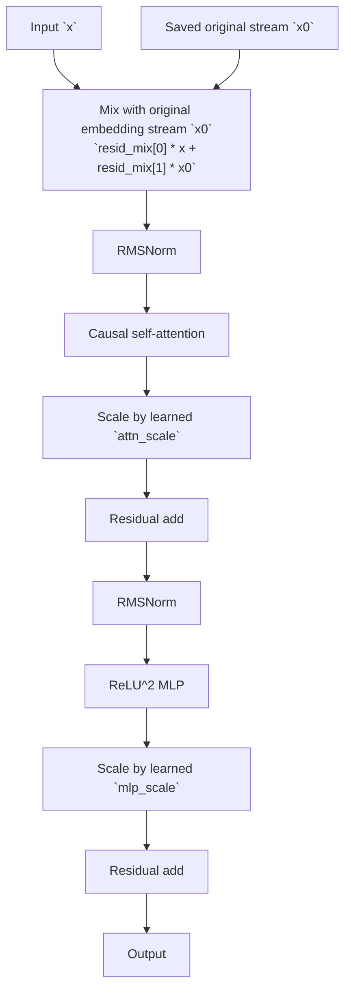

# `train_gpt.py` Explained

Before reading this file in full, open the handbook index:

- [Parameter Golf Learning Handbook](./README.md)

If you want deeper explanations of individual ideas, jump straight to:

- [Embeddings and RoPE](./embeddings_and_rope.md)
- [Normalization and RMSNorm](./normalization_and_rmsnorm.md)
- [Attention, MHA, MQA, and GQA](./attention_and_gqa.md)
- [MLP, Activations, and Width](./mlp_activation_and_width.md)
- [Residual Paths and Skip Connections](./residual_paths_and_skips.md)
- [Optimizers, Adam, and Muon](./optimizers_and_muon.md)
- [Challenge Metric: `val_bpb`](./challenge_metric_val_bpb.md)
- [Quantization and Artifact Size](./quantization_and_artifact.md)
- [Training Loop and Systems Choices](./training_loop_and_systems.md)
- [Data Pipeline and Shards](./data_pipeline_and_shards.md)
- [How To Contribute Ideas in Parameter Golf](./contributing_in_parameter_golf.md)

This note is written for someone who already understands a basic GPT-2 style model:

- token embeddings
- positional embeddings
- residual connections
- multi-head causal self-attention
- one feed-forward network per block
- normalization around the sublayers
- output head for next-token prediction

The main thing to know is that this repository is not trying to be a "clean textbook GPT-2 implementation." It is trying to be a good baseline for the **Parameter Golf** challenge, where the goal is:

- train under a short wallclock budget
- fit the final artifact under `16,000,000` bytes
- score well on tokenizer-agnostic compression (`val_bpb`)

Because of that, `train_gpt.py` combines several jobs in one file:

- define the model
- train the model
- evaluate with the challenge metric
- compress the final weights
- re-load the compressed weights and evaluate again

So when you feel "this is doing much more than GPT-2," that feeling is correct.

## 1. Repo Map First

If you want to understand the repo fast, think of it like this:

| File | Job |
|---|---|
| [`train_gpt.py`](../train_gpt.py) | Main CUDA/PyTorch training script. This is the center of the repo. |
| [`train_gpt_mlx.py`](../train_gpt_mlx.py) | Same general baseline idea, but for Apple Silicon with MLX. |
| [`data/cached_challenge_fineweb.py`](../data/cached_challenge_fineweb.py) | Downloads the published dataset shards and tokenizer from Hugging Face. |
| [`data/download_hf_docs_and_tokenize.py`](../data/download_hf_docs_and_tokenize.py) | Rebuilds tokenizers and re-tokenizes the published document list into challenge shard format. |
| [`data/README.md`](../data/README.md) | Data workflow explanation. |
| [`records/...`](../records) | Frozen snapshots of actual baseline runs and submissions. |
| [`README.md`](../README.md) | Challenge rules, baseline commands, artifact-size rules, and submission process. |

## 1.1 Current Code Landmarks

If you want to read the code with this document beside you, these are the main landmarks in the current file:

| Area | Rough location in [`train_gpt.py`](../train_gpt.py) |
|---|---|
| `Hyperparameters` | around lines `39-87` |
| `Muon` and Newton-Schulz update | around lines `96-168` |
| validation metric helpers | around lines `180-278` |
| int8 quantization / dequantization | around lines `288-422` |
| shard loading / token stream / distributed loader | around lines `429-494` |
| `RMSNorm`, `CastedLinear`, RoPE helpers | around lines `500-552` |
| attention / MLP / block / `GPT` model | around lines `555-724` |
| `main()` setup and training loop | around lines `731-1095` |

## 2. The Big Picture

Why does this repo look different from GPT-2?

Because the challenge objective is different from "train a normal language model in the cleanest possible way."

The code is optimizing for four things at the same time:

1. **Few parameters / small artifact**
2. **Fast training**
3. **Stable training at small scale**
4. **Good compression score on the challenge metric**

That pressure causes many of the deviations you noticed:

- no learned positional embedding table
- RMSNorm instead of LayerNorm
- GQA instead of full MHA
- smaller MLP (`2x` instead of GPT-2-style `4x`)
- tied embeddings
- learned residual control scalars
- U-Net-like skip reuse across the stack
- custom optimizer split
- explicit post-training quantization

## 3. End-to-End Flowchart

```mermaid
flowchart TD
    A["Start `train_gpt.py`"] --> B["Read `Hyperparameters` from environment"]
    B --> C["Set up CUDA / DDP / Flash Attention / logging"]
    C --> D["Load SentencePiece tokenizer"]
    D --> E["Load validation shards into memory"]
    E --> F["Build lookup tables for tokenizer-aware byte counting"]
    F --> G["Build `GPT` model"]
    G --> H["Move most model tensors to bf16"]
    H --> I["Keep small/control params in fp32"]
    I --> J["Compile model and Muon backend with `torch.compile`"]
    J --> K["Split params into optimizers:
token embedding -> Adam
lm head -> Adam (if untied)
matrices -> Muon
scalars/control tensors -> Adam"]
    K --> L["Create streaming train loader from shard files"]
    L --> M{"Warmup enabled?"}
    M -->|Yes| N["Run warmup steps to trigger compile/caches"]
    N --> O["Restore initial model + optimizer states"]
    M -->|No| P["Go to training"]
    O --> P["Main training loop"]
    P --> Q["Get contiguous token chunks"]
    Q --> R["Split across ranks and microsteps"]
    R --> S["Forward + backward under bf16 autocast"]
    S --> T["Apply LR warmdown + Muon momentum warmup"]
    T --> U["Optimizer step(s)"]
    U --> V{"Validate now?"}
    V -->|Yes| W["Compute `val_loss` and tokenizer-agnostic `val_bpb`"]
    V -->|No| X["Continue"]
    W --> X
    X --> Y{"Reached iteration limit or wallclock cap?"}
    Y -->|No| P
    Y -->|Yes| Z["Save raw PyTorch state_dict"]
    Z --> AA["Quantize weights to int8 + zlib compress"]
    AA --> AB["Write `final_model.int8.ptz`"]
    AB --> AC["Decompress + dequantize back into model"]
    AC --> AD["Run final roundtrip validation"]
    AD --> AE["Print final `val_loss`, `val_bpb`, and artifact size"]
```



## 4. The Fastest Mental Model of the Architecture

If you strip away the training and export machinery, the model is basically:

1. token embedding
2. RMSNorm on embeddings
3. first half of blocks, while saving skip activations
4. second half of blocks, while re-injecting saved skips in reverse order
5. final RMSNorm
6. tied or untied output projection
7. tanh logit softcap
8. cross-entropy loss

Two unusual ideas matter a lot:

- Each block can mix the current hidden state `x` with the original embedding state `x0`.
- The stack is split into an "encoder half" and "decoder half" with cross-stack skip connections.

So this is closer to:

- a GPT-like autoregressive transformer
- plus some U-Net-like skip reuse
- plus learned residual control knobs

than to plain GPT-2.

## 5. Model Flowchart



## 6. One Block, Very Clearly

Each `Block` does this:

```text
mixed = resid_mix[0] * x + resid_mix[1] * x0

attn_out = Attention(RMSNorm(mixed))
x = mixed + attn_scale * attn_out

mlp_out = MLP(RMSNorm(x))
x = x + mlp_scale * mlp_out
```

Important details:

- `resid_mix` is shape `[2, dim]`, so the mix is learned **per channel**, not just one global scalar.
- `attn_scale` is shape `[dim]`, so attention residual strength is learned per channel.
- `mlp_scale` is shape `[dim]`, so MLP residual strength is learned per channel.
- `resid_mix` starts as `[1, 0]`, which means the block initially trusts the current stream and ignores `x0`.
- `attn_scale` and `mlp_scale` start at `1`.

That means the model begins close to a normal residual transformer, but it is allowed to learn finer residual routing later.

## 7. Single-Block Flowchart



## 8. GPT-2 vs This Repo

This is the most important comparison table.

| Topic | Basic GPT-2 picture | `train_gpt.py` baseline | Why this repo does it |
|---|---|---|---|
| Positional information | Learned positional embeddings added to token embeddings | **RoPE** applied to `q` and `k` inside attention | Saves parameters, generalizes cleanly to sequence positions, and is now a common transformer choice |
| Normalization | LayerNorm | **RMSNorm** | Slightly simpler and cheaper; often works well in modern LLMs |
| Attention heads | Full MHA: same number of Q, K, V heads | **GQA**: `num_heads=8`, `num_kv_heads=4` by default | Reduces K/V projection cost and memory while keeping many query heads |
| MLP activation | GELU | **ReLU²** | Simple and cheap; comes from the modded-nanogpt lineage used here |
| MLP width | Often `4 * d_model` | **`2 * d_model`** by default | Saves parameters under a strict size budget |
| Output head | Separate LM head | Often **tied** to token embedding matrix | Huge parameter savings when vocab is nontrivial |
| Residual path | Plain residual adds | Learned `resid_mix`, `attn_scale`, `mlp_scale`, plus cross-stack skips | Gives extra control/stability without adding huge matrices |
| Logits | Raw logits | **tanh softcapped logits** | Helps keep logits from exploding during small, aggressive training runs |
| Optimizer | Adam everywhere | **Adam + Muon split by parameter type** | Matrix-shaped weights get a different update rule than small control tensors |
| Precision/export | Train and save in fp32/fp16 | Train in bf16/fp32 mix, then **int8 + zlib** export | Final artifact size is part of the challenge score |
| Validation | Token loss only | Token loss + **tokenizer-agnostic bits-per-byte** | Challenge metric should compare different tokenizers fairly |

## 9. What Each Main Section Is Doing

## 9.1 Hyperparameters

The `Hyperparameters` class is basically an environment-variable config block.

It groups:

- data paths
- logging cadence
- training length
- model shape
- optimizer settings

The baseline config is:

- `VOCAB_SIZE=1024`
- `NUM_LAYERS=9`
- `MODEL_DIM=512`
- `NUM_HEADS=8`
- `NUM_KV_HEADS=4`
- `MLP_MULT=2`
- `TRAIN_SEQ_LEN=1024`
- `TRAIN_BATCH_TOKENS=524288`

That is small by LLM standards, but here the artifact limit is very strict, so "small but efficient" is the whole game.

## 9.2 Muon Optimizer Section

`Muon` is only used on matrix-shaped transformer block parameters.

The idea in this script is:

- large 2D weights behave differently from tiny scalars/vectors
- so they should not necessarily get the exact same optimizer

What Muon does here:

1. keep a momentum buffer
2. optionally use a Nesterov-style combination
3. orthogonalize/normalize the update with Newton-Schulz iterations
4. apply the update

Why that can help:

- it can make matrix updates better behaved
- it treats the *direction* structure of a matrix update more explicitly
- it is a pattern borrowed from the `modded-nanogpt` ecosystem this repo adapts from

You do **not** need to understand every Newton-Schulz detail before the rest of the file makes sense. A good first approximation is:

> "Muon is a special optimizer for large matrices, while Adam handles embeddings and control tensors."

## 9.3 Tokenizer-Agnostic Validation

This part is challenge-specific and is one of the biggest differences from a normal training script.

The challenge metric is not just:

- "how low is next-token loss?"

It is closer to:

- "how well does the final system compress the validation text?"

Why?

Because different tokenizers change the meaning of "loss per token." If one tokenizer uses many short tokens and another uses fewer long tokens, raw token loss is not directly comparable.

So this script computes:

- `val_loss`: average token cross-entropy in nats
- `val_bpb`: bits per byte

The rough conversion is:

```text
bits_per_token = val_loss / ln(2)
val_bpb = bits_per_token * (tokens / bytes)
```

To estimate bytes correctly for SentencePiece tokens, the script builds lookup tables that track:

- how many UTF-8 bytes a piece contributes
- whether it begins with the special leading-space marker
- whether the previous token is a boundary/control token

That is why the validation code looks much more complicated than a usual `loss = model(x, y)` loop.

## 9.4 Post-Training Quantization

This section exists because artifact size matters.

The repo does **not** want to judge the model by its full-precision training checkpoint size, because that would waste bytes badly.

So after training it:

1. walks the state dict
2. keeps some small/control tensors in float
3. quantizes large float tensors to int8
4. uses per-row scales for 2D tensors
5. uses per-tensor scale for vectors/scalars
6. zlib-compresses the result
7. writes `final_model.int8.ptz`
8. reloads it and evaluates again

That last re-evaluation is important.

The score they care about is the score of the **round-tripped compressed artifact**, not just the pre-quantized training weights.

## 9.5 Data Loading

The shard format is simple:

- 256 int32s of header
- magic/version checks
- then `uint16` token ids

Why `uint16`?

- vocab sizes here are small enough to fit in 16 bits
- it saves space

The training loader is also intentionally simple:

- read shards in order
- consume a contiguous stream
- wrap around at the end
- split one chunk into rank-local spans
- build `x` and `y` by shifting by one token

This means the loader is:

- deterministic
- easy to reason about
- light on Python complexity

It is not trying to be a fancy sampled dataloader with workers and shuffling logic inside the loop.

## 10. The Attention Module in Detail

This attention is still causal self-attention, but with several changes from the GPT-2 picture you probably have in your head.

### 10.1 No learned position embedding table

There is **no** separate learned position embedding added at the input.

Instead:

- the token embedding creates `x`
- `q` and `k` are projected from `x`
- RoPE rotates `q` and `k` based on position

So position information enters *inside attention*, not as an extra vector summed into the token embedding.

### 10.2 GQA

The script uses:

- 8 query heads
- 4 key/value heads

This is grouped-query attention.

Intuition:

- many query heads preserve expressive attention patterns
- fewer K/V heads reduce parameter count and memory traffic

In a size-constrained model, that tradeoff is very attractive.

### 10.3 Q/K normalization

After projection, both `q` and `k` get RMS normalization before attention.

That is another stability knob:

- it reduces scale drift in the dot products
- it makes the later `q_gain` parameter easier to control

### 10.4 Learned `q_gain`

Each query head has its own learned gain.

So after RoPE, the code multiplies:

```text
q = q * q_gain
```

This gives the model a direct way to tune attention sharpness per head.

### 10.5 Flash-style PyTorch attention path

The actual attention call is:

- `torch.nn.functional.scaled_dot_product_attention`
- causal mode enabled
- flash backend enabled in setup
- GQA enabled when `num_kv_heads != num_heads`

That is mostly a systems/performance choice.

One more thing you may notice:

- the attention projections are bias-free
- the output projection is bias-free

That is another small parameter-saving simplification.

## 11. The MLP in Detail

The MLP is smaller and simpler than the classic GPT-2 one.

Instead of:

- expand to `4 * d_model`
- GELU
- project back

it does:

- expand to `mlp_mult * d_model` where `mlp_mult=2`
- `ReLU`
- square the activated values
- project back
- use bias-free linear layers

So the actual nonlinearity is effectively:

```text
ReLU(x)^2
```

Why use this here?

- it is simple
- it is cheap
- it comes from the modded-nanogpt baseline lineage
- it gives a stronger nonlinearity than plain ReLU without extra complexity

## 12. The Residual Tricks in Detail

These are the most non-GPT-2-looking parts of the architecture.

## 12.1 `x0`: the original embedding stream

Right after token embedding and RMSNorm, the model saves:

```text
x0 = x
```

That original stream is then available to every block.

This is unusual.

In plain GPT-2, a later block only sees the current hidden state coming from earlier blocks.

Here, each block can say:

- "use the current transformed stream"
- "reuse some of the original embedding stream too"

through `resid_mix`.

## 12.2 `resid_mix`

Each block learns how much of:

- current state `x`
- original state `x0`

to use before doing attention.

This can help preserve lower-level token information deeper into the network.

## 12.3 `attn_scale` and `mlp_scale`

These are learned per-channel residual branch scales.

So instead of:

```text
x = x + attn_out
x = x + mlp_out
```

the block does:

```text
x = x + attn_scale * attn_out
x = x + mlp_scale * mlp_out
```

That gives finer control over residual strength.

## 12.4 Cross-stack skip connections

The first half of the network stores outputs into a list.

The second half pops them back in reverse order and adds them with learned `skip_weights`.

For `NUM_LAYERS=9`:

- encoder half = `4` blocks
- decoder half = `5` blocks
- skip count = `4`

So the later 4 decoder blocks each receive one saved encoder activation, and the extra decoder block has no matching skip to pop.

This is very much a "use features from earlier depth again later" idea, similar in spirit to U-Net skip reuse, but inside an autoregressive transformer.

## 13. Why There Is No Dropout

You probably expected dropout because basic GPT-2 tutorials usually include it.

This file has **no dropout**.

That makes sense here because:

- the run is short and compute-constrained
- the model is already small
- the training objective is dominated by fitting under a strict budget
- extra stochastic regularization is not always the best tradeoff in this setting

So the script favors simplicity and speed.

## 14. Output Layer and Loss

Two details matter here.

### 14.1 Tied embeddings

If `tie_embeddings=True`, the script uses the token embedding matrix again as the output projection.

That is a classic parameter-saving trick:

- input embedding: `vocab_size x model_dim`
- output head: usually another `model_dim x vocab_size`

Tying them removes one of those big matrices.

Under a small artifact budget, that is a huge deal.

### 14.2 Logit softcap

The logits are not used raw. The code does:

```text
logits = softcap * tanh(logits_proj / softcap)
```

This keeps logits bounded in magnitude.

Why do that?

- aggressive training can create very large logits
- large logits can destabilize optimization or calibration
- a soft cap is gentler than hard clipping

So this is another stability-oriented choice.

One subtle but important implementation detail:

- `GPT.forward(...)` returns the **scalar cross-entropy loss directly**
- it does **not** return logits to the training loop

So the training loop is simpler than many tutorial implementations:

```text
loss = model(x, y)
loss.backward()
```

## 15. Precision Strategy

The script uses mixed precision in a very deliberate way.

Broadly:

- most of the model runs in `bfloat16`
- `CastedLinear` keeps the stored weight in fp32 but casts at matmul time
- small/control tensors are restored to fp32

Why this split?

- bf16 gives speed and memory savings
- fp32 storage for important small tensors can keep optimizer/state quality better
- control tensors are too important to risk over-quantizing during training

This is why the code has both:

- `.bfloat16()` on the model
- special casting behavior in `CastedLinear`
- `restore_low_dim_params_to_fp32(...)`

## 16. Optimizer Split

This part is extremely important to understand.

The script does **not** use one optimizer for everything.

It splits parameters into groups based on their role:

- token embeddings -> Adam
- untied output head -> Adam
- 2D transformer matrices -> Muon
- scalars, vectors, and named control tensors -> Adam

Why split them?

Because these groups behave differently:

- giant matrices dominate representational learning
- embeddings often want different LR behavior
- tiny scale/mix parameters are fragile and should be handled conservatively

This is a modern training-engineering choice, not a GPT-2 architectural change, but it affects the whole script.

## 17. Constant Effective Batch Across GPU Counts

One subtle systems idea is here:

```text
grad_accum_steps = 8 // world_size
```

and the script requires `world_size` to divide `8`.

That means:

- 8 GPUs -> `grad_accum_steps = 1`
- 4 GPUs -> `grad_accum_steps = 2`
- 2 GPUs -> `grad_accum_steps = 4`
- 1 GPU -> `grad_accum_steps = 8`

So the code tries to keep the **effective total batch** aligned with the 8-GPU baseline.

That is useful because it makes runs across machine sizes more comparable.

## 18. Why There Is a Warmup That Gets Undone

This is easy to miss.

The warmup section does real forward/backward/optimizer steps, but then the script restores:

- the initial model weights
- the initial optimizer state

So why do it?

Because the purpose is **not** to train.

The purpose is to:

- trigger `torch.compile`
- populate runtime caches
- pay setup costs early

and then start the measured training from the original initialization.

That is a benchmarking/fairness trick.

## 19. Training Loop, Step by Step

A single real training step looks like this:

1. decide current LR multiplier from wallclock-aware warmdown
2. zero all grads
3. for each microstep:
4. get the next contiguous token chunk
5. build `x` and `y`
6. run forward under bf16 autocast
7. accumulate the detached loss for logging
8. backprop scaled by `1 / grad_accum_steps`
9. warm up Muon momentum toward its target value
10. apply per-optimizer learning rates
11. optionally clip grads
12. step all optimizers
13. zero grads again
14. maybe log train loss
15. maybe run validation
16. stop if iteration budget or wallclock cap is reached

This loop is simple in structure, but there are many hidden systems choices around it:

- DDP sync only on the last microstep
- flash attention backend
- wallclock-based early stopping
- wallclock-aware warmdown

## 20. Why the Validation Loader Looks Different from the Training Loader

Training:

- uses a streaming loader
- loops forever through train shards
- does not try to cover the dataset exactly once

Validation:

- loads the fixed validation token stream
- slices the validation set deterministically across ranks
- computes global totals with `all_reduce`

That difference is intentional:

- training wants speed and simplicity
- validation wants a stable, fixed benchmark

## 21. Why the Whole Script Lives in One File

The challenge README says the submission artifact counts:

- code bytes
- compressed model bytes

and counted code should live in `train_gpt.py`.

So the script is intentionally monolithic.

That is not because this is the prettiest software architecture.

It is because the challenge rewards:

- self-contained code
- easy reproducibility
- byte-aware packaging

Once you understand that constraint, the file structure makes much more sense.

## 22. The Main "History" Behind the Changes

A safe high-level history is:

1. **GPT-2-era transformer defaults** gave you learned absolute position embeddings, LayerNorm, full MHA, GELU MLPs, separate output heads, and mostly Adam-based training.
2. **Later LLM practice** showed that many alternatives often work well or better in practice: RoPE, RMSNorm, grouped-query attention, parameter tying, mixed precision, flash-attention-style kernels, and more specialized optimizer choices.
3. **This repo adds challenge-specific pressure** on top of that: the final answer must fit in a tiny artifact, train fast, and score well under tokenizer-agnostic compression.

So the script is best understood as:

- partly "modern transformer engineering"
- partly "modded-nanogpt baseline style"
- partly "challenge-specific compression and packaging logic"

## 23. What To Read in What Order

If you want to understand the whole repo quickly, use this order:

1. [`README.md`](../README.md)
   Learn the challenge objective and why artifact size matters.
2. [`train_gpt.py`](../train_gpt.py) from top to bottom, but mentally split it into:
   hyperparameters -> optimizer -> validation metric -> quantization -> data loader -> model -> training loop
3. [`data/README.md`](../data/README.md)
   Understand where shards and tokenizers come from.
4. [`data/cached_challenge_fineweb.py`](../data/cached_challenge_fineweb.py)
   This tells you the "normal path" for getting the published dataset.
5. [`data/download_hf_docs_and_tokenize.py`](../data/download_hf_docs_and_tokenize.py)
   Read this only when you want to change tokenizer or rebuild shards.
6. [`records/.../README.md`](../records)
   These show what actual runs looked like and what metrics mattered.

## 24. Short "Translation" from Your GPT-2 Mental Model

If I translate this repo into your current understanding:

- "token embedding" is still there
- "position embedding" moved from a learned table to **RoPE inside attention**
- "multi-head causal attention" is still there, but now with **GQA**, **Q/K RMSNorm**, and **head gains**
- "FFN" is still there, but smaller and using **ReLU²**
- "residual connection" is still there, but now with **learned channelwise scaling** and **mixing with the original embedding stream**
- "stack of blocks" is still there, but now the stack has **cross-half skip reuse**
- "final output head" is still there, but often **tied to embeddings**
- "training loop" is still there, but now heavily engineered around **speed, compression, and challenge evaluation**

So the best way to think about it is:

> This is still a GPT-like causal transformer, but tuned for a parameter-budget competition rather than for textbook simplicity.

## 25. If You Only Remember 10 Things

1. The repo is for a challenge where **compressed artifact size matters**, not just loss.
2. `train_gpt.py` includes training, validation, compression, and roundtrip evaluation in one file because of that challenge structure.
3. There is **no learned positional embedding table**; position is handled by **RoPE** inside attention.
4. There is **no dropout** in this baseline.
5. Attention uses **GQA** with fewer K/V heads than Q heads.
6. Blocks use **RMSNorm**, **ReLU² MLP**, and learned residual control tensors.
7. Every block can mix with the original embedding stream `x0`.
8. The network uses **cross-stack skip connections** between the first and second halves.
9. Training uses an **optimizer split**: Adam for some params, Muon for matrix params.
10. Final scoring uses the **quantized + compressed** model, so export logic is part of the actual model pipeline.

## 26. Good Next Questions To Ask

Once this document feels clear, the next useful questions are:

- "Show me one exact forward pass with tensor shapes."
- "Explain one `Block` with a tiny numeric example."
- "Explain `val_bpb` with a concrete tokenization example."
- "Show me how `NUM_LAYERS=9` turns into 4 encoder blocks + 5 decoder blocks."
- "Show me exactly which parameters go to Adam vs Muon."
- "Compare this baseline against the frozen record run in `records/`."

Those are all good next steps because they zoom in on the hardest parts without losing the overall map.
